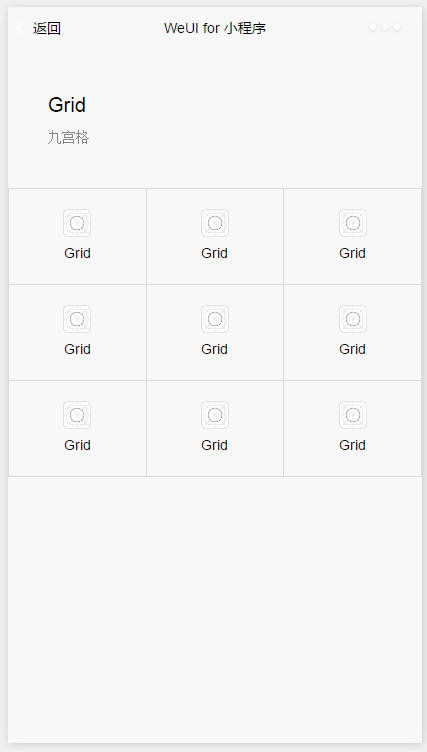
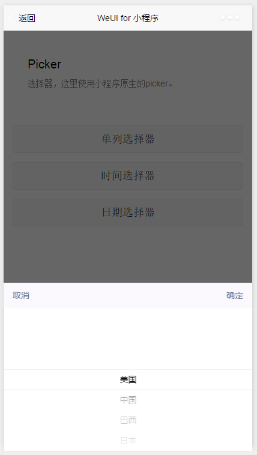

## 微信小程序UI范例

# 表单
## form
* [button](#button)
* [list](#list)
* [input](#input)
* [slider](#slider)
* [ploader](#ploader)

# 基础组件
## baseui
* [article](#article)
* [badge](#badge)
* [footer](#footer)
* [grid](#grid)
* [icons](#icons)
* [loadmore](#loadmore)
* [panel](#panel)
* [preview](#preview)
* [progress](#progress)

# 操作反馈
## opration 
* [acticesheet](#acticesheet)
* [dialog-Alert](#dialogalert)
* [dialog-Confirm](#dialogconfirm)
* [picker-单列选择器](#picker1)
* [picker-时间选择器](#picker2)
* [picker-日期选择器](#picker3)
* [toast-加载中提示](#toast1)
* [toast-成功提示](#toast2)

# 导航相关
## bar
* [navbar](#navbar)
# 搜索相关
* [searchbar](#searchbar)

# 表单展示
## button

[返回](#form)

## list

[返回](#form)

## input

[返回](#form)

## slider

[返回](#form)

## ploader

[返回](#form)

# 基础组件UI展示

## article

[返回](#baseui)
## badge

[返回](#baseui)
## footer

[返回](#baseui)
## grid

[返回](#baseui)
## icons

[返回](#baseui)
## loadmore

[返回](#baseui)
## panel

[返回](#baseui)
## preview

[返回](#baseui)
## progress

[返回](#baseui)

# 操作反馈
## acticesheet

[返回](#opration)
## dialogalert

[返回](#opration)
## dialogconfirm

[返回](#opration)
## picker1

[返回](#opration)
## picker2

[返回](#opration)
## picker3

[返回](#opration)
## toast1

[返回](#opration)
## toast2

[返回](#opration)

#导航相关
## navbar

[返回](#bar)

# 搜索相关
## searchbar

[返回](#bar)

